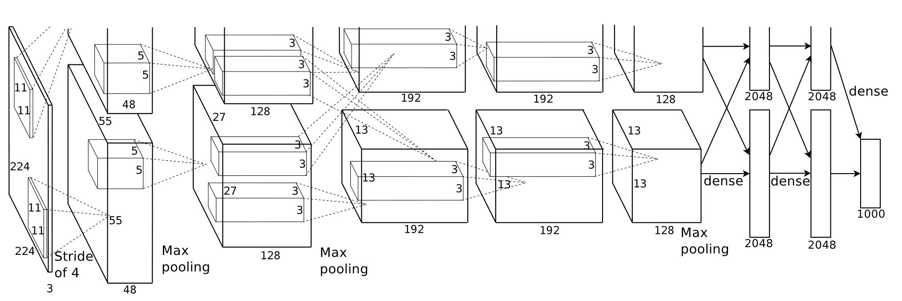

## AlexNet

### Abstract
* 提出一个深度卷积神经网络，用来在ImageNet竞赛上做图像分类，效果：优于之前最好的结果
* 模型结构上：
    * 拥有6000万参数，650,000个神经元
    * 包含5个卷积层，池化层，3个全连接层，1000路的softmax
* 使用GPU -> 训练快
* 使用dropout -> 减少全连接层的过拟合

### Introduction
* 带标签数据集的规模限制了模型的能力，为了使模型能够识别更多的物体，我们需要使用更大的训练数据集来训练我们的模型
* 为了能够从更多的图片中学习，我们的模型需要有更大的学习能力。而卷积神经网络拥有更少的连接和参数使得容易训练。
* 作者训练了一个深度卷积神经网络，在ImageNet竞赛中，得到了最好的结果。作者针对GPU上的2d卷积操作做了优化。提升了模型精度，减少了训练时间。
* 使用了一些技术防止了过拟合。
* 作者发现，如果从5层卷积层和3层全连接层中拿掉任意一层，最终的结果会比之前的差。

### The Dataset
* 在ImageNet中，使用12,000,000做训练集，50,000做验证集，150,000做测试集。

### The Architecture
* 神经元的输出结果经过一个非线性操作 $f$ ,通常 $f(x) = tanh(x)$ 或者 $f(x) = \frac{1}{1 + e^{-x}}$ ,但随着梯度下降，训练过程很慢。
* 使用ReLU来训练比 $tanh$ 快。如果在我们的大模型中使用其他的非线性操作，我们的训练将无法继续下去。
* 多GPU训练：GPU之间的通信仅在特定的层进行。
* 局部响应归一化
    * 经过卷积层之后，输入 $ReLU$ ,输出结果为 $a_{x, y}^i$ ,表示第 $i$ 个特征响应图中，${x, y}$ 位置的点 ,经过响应归一化之后，得到 $b_{x, y}^i$
    $$b_{x, y}^i = a_{x, y}^i / (k + \alpha \sum\limits_{j = max(0, i - n / 2)}^{min(N - 1. i + n / 2)} (a_{x, y}^j)^2)^\beta$$
    * 解释：与 $a_{x, y}^i$ 毗邻但不在同一特征响应图的点做局部归一化。
    * 超参：$k$, $n(临近kernel-map个数)$, $\alpha$ , $\beta$.
* 重叠池化可能使得模型训练更难过拟合。
* 整体架构
    * 共有8个带参数的层：5个卷积层、3个全连接层
    * 输出结果经过 $1000$ 路的 $softmax$,对应这 $1000$ 类的标签。
    * 第一、二个卷积层之后接入响应归一化层。
    * 最大池化层接在响应归一化层和第五卷积层之后
    * 每个卷积层和全连接层之后都使用 $ReLU$

* 分层架构
    * input: (224 x 224 x 3)
    * 卷积层
        1. kernel_size: (11 x 11 x 3), 共96个核， stride: 4, no-padding, 经过响应归一化、池化操作。
        2. kernel_size: (5 x 5 x 48), 共256个核。
        3. kernel_size: (3 x 3 x 256), 共384个核
        4. kernel_size: (3 x 3 x 192), 共384个核
        5. kernel_size: (3 x 3 x 192), 共256个核
    * 全连接层
        

### 减少过拟合

#### 数据增强
* 随机裁剪：从大小为256 x 256的图像中随机裁剪出大小为224 x 224(及其水平镜像翻转的)
* 改变训练图像中RGB通道的强度：在训练集图像的像素集合中使用PCA算法，对于每个训练样本，成倍增加已有主成分，比例大小为对应特征值乘均值为零,标准差为0.1的高斯分布。

#### Dropout
* 以0.5的概率将每个隐层神经元的输出设置为零

