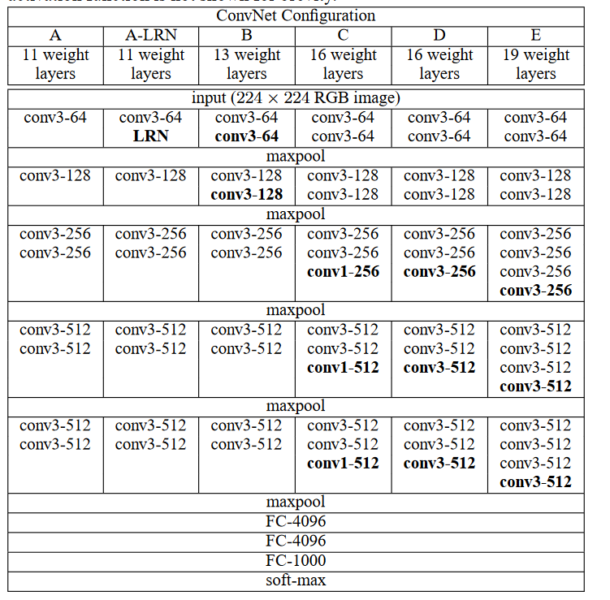

## VGG

### Abstract
* 卷积神经网络的深度对精确度的影响：使用`3x3`的小卷积核，增加深度至16-19层，可以实现对**现有技术配置**的显著改进。

### Introduction
* 讨论了ConvNet架构设计的另一重要方面——深度。
* 保持其他结构参数配置不变，通过增加更多的卷积层来使得网络的深度稳定增加，其中应用的手段是：在所有层中均采用3x3的小卷积核。
* 提出了两个性能最好的模型。

### ConvNet配置
* 整体架构
    1. 图像预处理：输入图像（`224 x 224`)的每个像素点减去RGB的平均值。
    2. 经过卷积层，其中卷积核大小均为3 x 3。随后经过一个偏置项，可看做一个非线性操作。
    3. 经过一堆卷积层之后，接入3个全连接层，最后经过 $softmax$ 层。
    4. 所有隐藏层均使用 $ReLU$ 非线性单元；局部响应归一化并不能改善在ILSVRC数据集中的性能，反而会增加内存消耗和训练时间的延长。

* 配置

* 讨论
    * VGG在第一个卷积层中没有使用相对大的感受野。
        * 例如：2个`3x3`的卷积与1个`5x5`的具有相同感受野。
    * 使用多个小卷积核替代一个大卷积核的意义：使得决策函数更具辨别力。
        * 经过每个卷积核之后，都会接入一个非线性单元。

* 训练：训练步骤大致跟随AlexNet。

* **测试**：将全连接等效替换成卷积层进行测试。
    * 将卷积核大小设置为输入空间大小即可：例如输入为`7x7x512`，第一层全连接层输出4096；我们可以将其看作卷积核大小为`7x7`，步长为1，没有填充，输出为`1x1x4096`的卷积层。

* 分类实验
    * 单尺度评估：不应用归一化方法。
    * 多尺度评估：测试时尺度抖动。？？
    * 多裁剪评估？？
    * 卷积网络融合：通过平均它们的 $soft-max$ 类后验来结合一些模型的输出，这会提高他们的性能由于模型之间的互补性质。

* 结论：**深度**对网络正确率的影响是有益的，可以用传统的卷积神经网络架构（Lenet和AlexNet）在此基础上达到ImageNet的最佳性能

