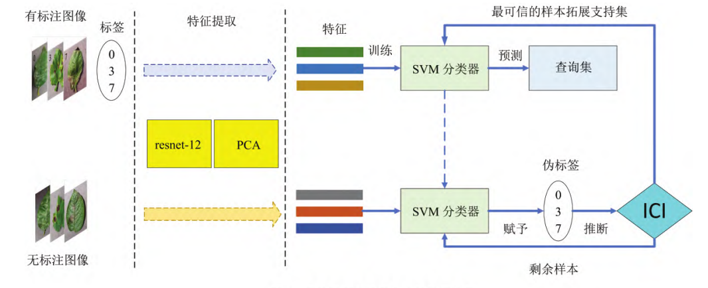

## Semi-Supervision-Learning

### Overview
> Reference: 《机器学习-周志华》
1. 使用未标记的样本
    * 有训练样本集 $D_l = \{(x_1, y_1), (x_2, y_2), ..., (x_l, y_l)\}$ , 均为有标记样本
    * 另外还有 $D_u = \{(x_{l + 1}, y_{l + 1}), (x_{l + 2}, y_{l + 2}), ..., (x_{l + u}, y_{l + u})\}, l \ll u$ ,这u个样本均为类别标记未知
    * 若直接使用传统监督学习技术，则仅有 $D_u$ 能用于构建模型 $D_u$ 所包含的信息被浪费了.另一方面，若 $D_u$ 较小，则由于训练、样本不足，学得模型的泛化能力往往不佳
    * 分类与分布：有标记的样本已经有了明确的分类，而对于无标记的样本，若他们与有标记样本是从同样的数据源独立同分布采样而来，它们所包含的数据分布的信息对模型是有意义的
    * 未标记样本所揭示的数据分布信息与类别标记相联系的假设：==相似的样本拥有相似的输出==
    * 半监督学习可划分为纯半监督学习和直推学习
    

2. 生成式方法
...

### Specific Fields - Application & Inspiration

***
* 基于实例置信度推断的半监督小样本植物病害图像识别
    * Cite: 孔江波，朱 贺，张延文，等． 基于实例置信度推断的半监督小样本植物病害图像识别［J］． 江苏农业科学，2022，50( 12) : 229 － 237．doi: 10． 15889 /j． issn． 1002 － 1302． 2022． 12． 035
    * 使用方法：首先构建ResNet-12网络提取有标注样本和无标注样本的特征；其次利用极少数有标签的植物病害样本训练SVM分类器，用分类器推断无标注样本的类别并赋予伪标签；然后采用实例置信度推断(ICI)算法获取伪标注样本的置信度，迭代选择可信的伪标签样本加入训练拓展支持集；最后应用训练后的网络模型对植物病害图像进行识别。
    

* SSA-Net: Spatial self-attention network for COVID-19 pneumonia infection segmentation with semi-supervised few-shot learning
    * 问题：胸部CT图像不规则的形状和模糊的边界
    * 工作：
        * 利用自我注意机制通过从更深层提取有用的上下文信息而无需额外的训练时间来扩展接受领域并增强表示学习，并引入空间卷积以增强网络并加速训练收敛。
        * 为了缓解标记多类数据的不准确性和训练数据的长尾分布，提出了一种基于重新加权损失和选择高置信度预测值的半监督少样本迭代分割框架。它可以通过少量标记的图像数据对不同类型的感染进行准确分类。
***